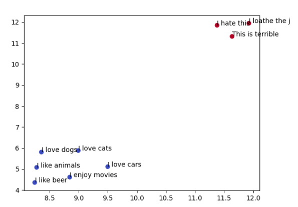
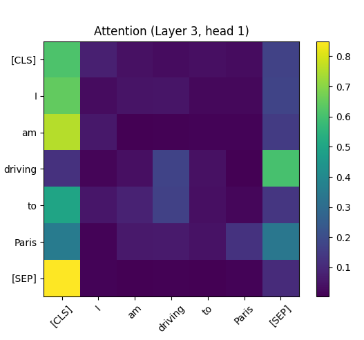

### NLP Lab
Dieses Repository enthält Python-Snippets, um die Funktionsweise von NLP-Architekturen und Frameworks praktisch zu verstehen.

- [embedding-plot.py](embedding-plot.py) wandelt Sätze in semantische Vektoren um, gruppiert sie automatisch per KMeans nach Ähnlichkeit und visualisiert diese Gruppen als Punkte im 2D-Raum.

- [bert-attention-scores.py](bert-attention-scores.py) lädt ein BERT-Modell, extrahiert die Self-Attentions für einen Satz und analysiert sowie visualisiert, wie einzelne Tokens über verschiedene Layer und Heads hinweg aufeinander achten; hilfreich, um zu verstehen, wie Exbert-Heatmaps generiert werden: https://huggingface.co/spaces/exbert-project/exbert

- ...
- 